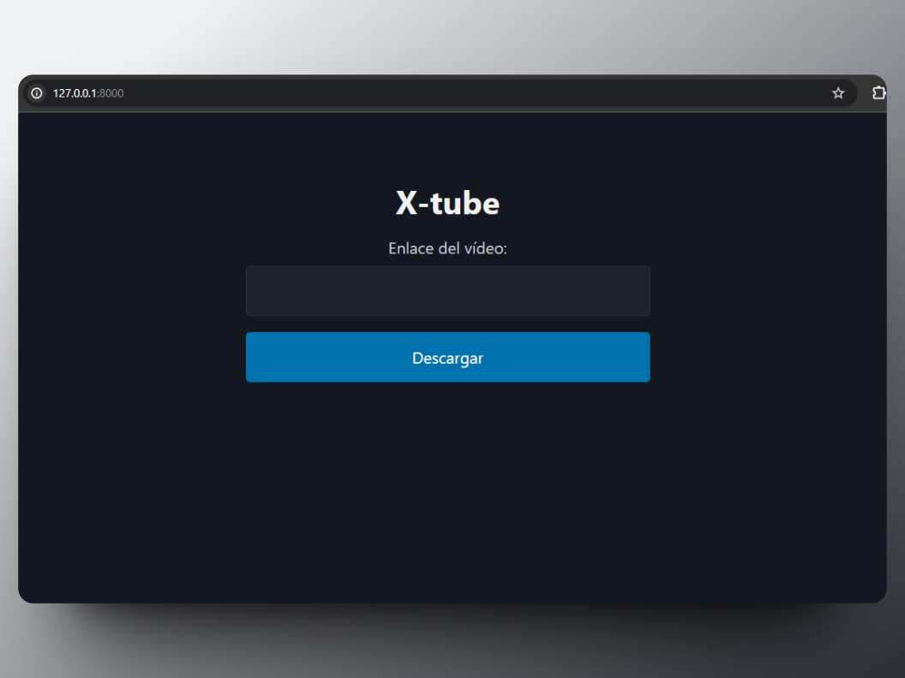

Estaba harto de las interminables páginas de descarga de videos plagadas de anuncios, así que decidí tomar cartas en el asunto y crear mi propio sistema de descarga de videos de YouTube: X-Tube. 🚀



👉 **Clonar el proyecto desde el repositorio:**

Primero, asegúrate de tener Git instalado en tu sistema. Luego, ejecuta el siguiente comando en tu terminal para clonar el repositorio de tu proyecto Django:

```bash
git clone git@github.com:xvipj/X-tube.git
```

👉 **Instalar los paquetes del archivo `requirements.txt`:**

Una vez que hayas clonado el proyecto, navega hasta el directorio del proyecto en tu terminal. Luego, instala los paquetes necesarios utilizando pip y el archivo `requirements.txt`. Ejecuta el siguiente comando:

```bash
pip install -r requirements.txt
```

Esto instalará todas las dependencias necesarias para tu proyecto Django.

👉 **Ejecutar el proyecto sin aplicar migraciones:**

Después de instalar los paquetes, puedes ejecutar tu proyecto sin aplicar migraciones. Utiliza el siguiente comando para arrancar el servidor de desarrollo de Django:

```bash
python manage.py runserver
```

Esto iniciará el servidor de desarrollo en tu máquina local. Puedes acceder a tu proyecto en un navegador web visitando `http://localhost:8000/`.

Recuerda que al no aplicar migraciones, es posible que ciertas funcionalidades de tu proyecto no estén disponibles o funcionen correctamente. Este enfoque es útil en situaciones donde necesitas ejecutar rápidamente el proyecto sin preocuparte por la base de datos.
